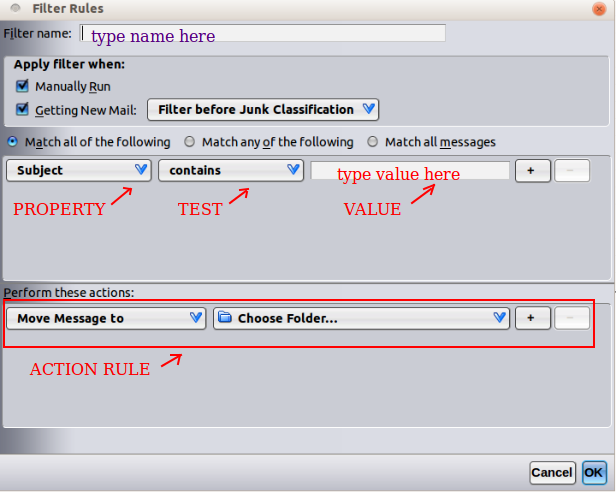

# 使用过滤器管理邮件

> 查看对应的 [帮助文档](https://support.mozilla.org/zh-CN/kb/%E4%BD%BF%E7%94%A8%E8%BF%87%E6%BB%A4%E5%99%A8%E7%AE%A1%E7%90%86%E9%82%AE%E4%BB%B6)

## 摘要

使用过滤器管理收到的邮件。

## 操作步骤

### 过滤器何时执行？

当您收到新邮件 - 选中 正在获取新邮件 （默认），过滤器就被应用到收件箱中的新邮件。

这可以发生在 Thunderbird 的垃圾邮件分级之前或之后。

如果您对过滤的邮件本身感到困难，选择之后过滤选项。

当您发送邮件 - 选中 发送后。过滤器仅被应用到正在发送的邮件。

当您存档邮件 - 选中 存档 。过滤器会被应用到所有存档的邮件。

过滤器按照在规则列表中的显示顺序依次执行，除非该顺序不可能。

这种情况下，您将看到 注意：过滤器将按照不同顺序运行 的消息和 **查看执行顺序** 的链接。

点击链接，您将看到使用顺序。 

例如：如果一个过滤器将消息移动到另一个文件夹，然后下一个过滤器用于回复，那么由于消息已经不在这个文件夹中，回复过滤器将失效。 

Thunderbird 将改变顺序，让回复过滤器在移动过滤器之前执行。

### 创建新过滤器
1. 点击应用菜单按钮，点击 **工具**，然后点击 **消息过滤器**。

2. 点击 “新建”，会出现一个 **过滤器规则** 对话框。

3. 在 "过滤器名称" 一栏，给过滤器输入一个名字。

4. 在下面的 "执行过滤器，当" 一栏, 勾选其中的一项或两项。

**注意：大多数情况下，您不需要更改 “手动运行” 和 “正在获取新邮件：” 这两个选项的默认设置。**

5. 在 "正在获取新邮件：" 选项的下拉菜单中，选择 “在垃圾邮件分级之前过滤” 或 “在垃圾邮件分级之后过滤”。

6. 为您想要应用的规则选择 “属性”， “检验” 和 “值” ：

* 属性 是邮件的某一元素或特征，例如 “主题” 或 “发件人”
* 检验 是属性的可选项，例如 “包含” 或 “在我的通讯录中”
* 值 是匹配 “检验” 的具体的细节，比如电子邮件地址或关键字

7. 为符合这些标准的邮件选择一个或多个执行动作。

8. 点击确定。

9. 在 **消息过滤器** 对话框的最上面一行，为过滤器选择账号（从下拉列表）。

10. 如果想对已经收到邮件应用新过滤器，在 **消息过滤器** 对话框，点击 “立即执行”。过滤器在保存后会自动应用于所有新收到的邮件。

### 添加星标

您可能希望对工作领域的所有邮件自动添加星标，从而比收件箱中其他邮件更加醒目。您可以创建这样一个过滤器：

### 移至其他文件夹

您可能希望从杂乱的收件箱中过滤掉低优先级的邮件。例如，您可能已经选择接收经常光顾的商家的通知，但是想让这些通知出现在一个单独的文件夹中。

首先，通过点击 `文件 > 新建 > 文件夹`，创建一个名为 “优惠”（或其他类似的名称）的文件夹，然后您可以创建一个过滤器，比如：

点选 "满足以下任一条件" 后，所有邮件中只要满足这些条件中的其中一条，就会被从收件箱自动移至优惠文件夹：

* 发件人地址是 sales@software.biz，或
* 主题中带有 “促销” 字样，或
* 地址或显示名称中带有 “customer” 字样 (“customer.service”, “Customer Support” 等等)

## 预期结果

设置 Thunderbird 实现自动管理邮件的功能。

## 其他说明

本文中，**预期结果**中不含有图片，但不影响测试者理解预期结果。

本测试用例面向 openEuler 操作系统，但本文使用的图片来源于官网帮助文件，因此图片中的 Thunderbird 可能是其他系统下的，界面并没有太大区别，在此处供测试者参考。
