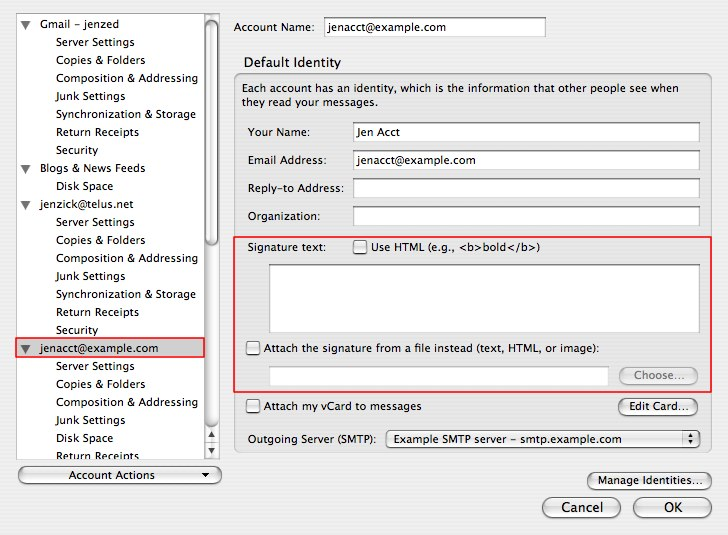
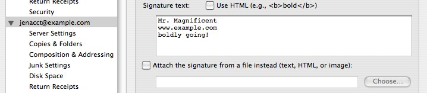
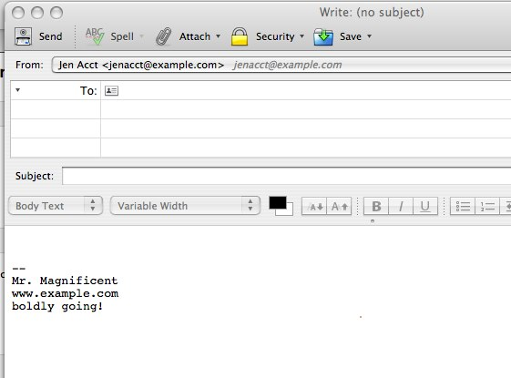
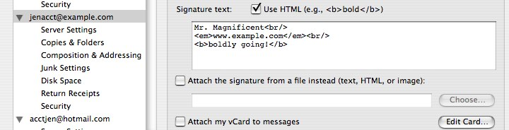
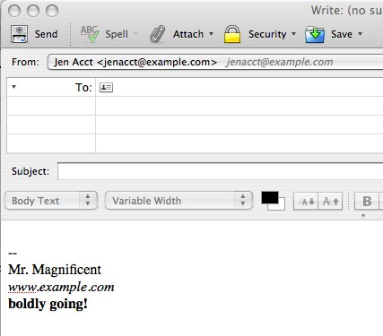
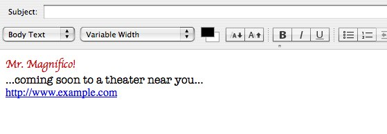
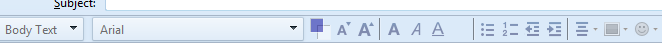
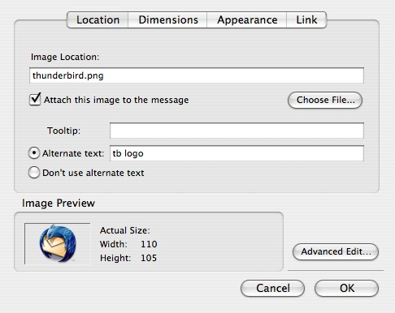

# 配置签名

> 查看对应的 [帮助文档](https://support.mozilla.org/zh-CN/kb/Thunderbird%E4%B8%AD%E9%85%8D%E7%BD%AE%E7%AD%BE%E5%90%8D)

## 摘要

“签名”是一块自动附加到每个您发出的消息的文字（包括新消息和对收到消息的回复）。

他们通常用来提供与每个消息有关的附加联系信息，法律条款或一些其他引用信息。

## 操作步骤

通过 Thunderbird 的**账户设置**界面创建签名。点击 **工具 | 账户设置**, 然后, 在左边的面板中选择您要创建签名的账户。

### 纯文本签名

要配置一个纯文本签名，在**签名文字**区域中输入您想要附加到每份外发消息的文字。纯文本签名可使用在 HTML 和文本消息中。

...结果是...

### HTML 签名

要在您的签名中使用 HTML 格式, 选中 **使用 HTML** 并将签名文字修饰成想要的 HTML 格式。如果您发送的消息是文本格式的（而不是 HTML），为 HTML 标记文字字符将被替代。

...结果是...

### 保存在文件中的签名

作为一种选择，您可以上传一个包含有您签名的文件。

选中**附加从替代文件来的签名**并然后点击 `选择...` 选择文件。

文件可以包含或者纯文本或 HTML 格式文字。如果您有一个 HTML 格式的签名，那么消息的接收方必须在他们的电子邮件程序中能够显示 HTML 格式的消息。

如果他们关闭了这个功能，签名会被以文本格式体现，照片不会被显示。

创建签名文件的一种途径是使用 Thunderbird 编写器。作为一个例子，在 Thunderbird 中创建一个新 HTML 格式的消息（`文件 / 新 / 消息`）。确认格式工具栏显示出来了。

（如果没有显示，您在编写的是一个文本格式的消息，而不是 HTML 格式的。要变更为 HTML 格式，选择 `选项 / 发送格式 / 仅多信息（HTML）文本。`）

### 编写和格式化您想要的签名。注意大量的格式功能在 `插入` 和 `格式` 菜单中。

1. 点击 `文件 / 保存为 / 文件`。确认“HTML 文件”被选择了，然后指定一个文件名并点击 `保存`。
2. 关闭消息窗口并丢弃为保存的消息。

4. 打开账户设置并选择位于左边面板的电子邮件账户。
5. 选中 `附加从文件来的签名`, 点击 `选择` 导航之您创建的文件

### 在签名中包含图片文件

要在一个签名中包含从您本地计算机来的一张图片，首先按照如上步骤创建 HTML 签名。当您在编写签名内容时，然而使用 `插入 / 图片` 菜单选项指定想要的图片。

除了选择图片文件，使用这个对话配置图片的其他方面，例如大小，URL 链接，在文本中的位置，等等。

您也可以指定一个位于网络服务器的图片作为您的附件。简单地指定图片的 URL 地址另外还有文件名。

如果您选中`附加图片到消息`，图片会以附件的形式包含进来。如果您不附加图片，消息的接收方必须有互联网连接来显示图片。

同样，切记出于安全原因许多人配置他们的邮件程序阻拦远程内容，这将阻止显示图片除非它被附加到消息。

### 签名位置

当您在回复消息时，默认情况下您的签名会出现在消息末端所引用文字之后。要改变这个方式，选择 `工具 | 账户设置 | <账户名称> | 撰写 & 发言`。

变更回复风格为“在引用前开始我的回复”。下一步，变更设置从“并放置我的签名”到“在我的回复之后（引用之前）”。

这个设置可以为每个账户和每个身份配置。

## 预期结果

成功设置邮件签名，以及签名位置。

## 其他说明

**如果您有多个账户，您必须为每个账户单独配置签名。**

**如果您选中`附加图片到消息`，图片会以附件的形式包含进来。如果您不附加图片，消息的接收方必须有互联网连接来显示图片。**

本文中，**预期结果**中不含有图片，但不影响测试者理解预期结果。

本测试用例面向openEuler操作系统，但本文使用的图片来源于官网帮助文件，因此图片中的Thunderbird可能是其他系统下的，界面并没有太大区别，在此处供测试者参考。
