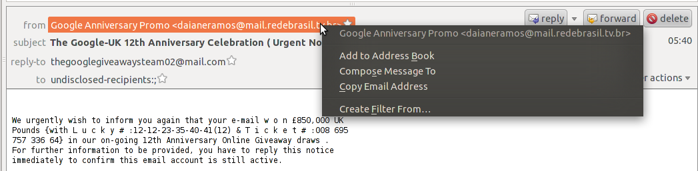
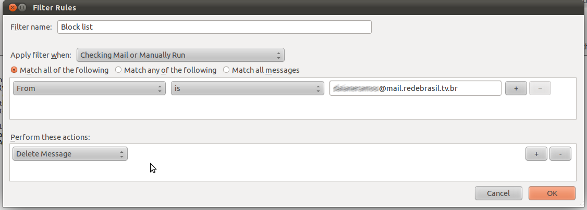

# 阻止特定的发件人

> 查看对应的 [帮助文档](https://support.mozilla.org/zh-CN/kb/%E9%98%BB%E6%AD%A2%E7%89%B9%E5%AE%9A%E7%9A%84%E5%8F%91%E4%BB%B6%E4%BA%BA#thunderbird:linux:tb102)

## 摘要

阻止对特定发件人的邮件的接收。

## 操作步骤

选择一条你想阻止的发件人的消息：右键点击 该发件人的地址并选择 **对此创建过滤器...**

* 这将打开 **过滤规则** 窗口，并自动在过滤器中输入该发件人地址。

1. 请命名该过滤器，比如“阻止名单”。

2. 在窗口下半部分，把“执行动作”设置为 **删除消息**。

* 点击 “确定” 以保存过滤器。下次该发件人发送消息给你时，过滤器将自动删除消息。

你创建的消息过滤器可以通过选择 **工具** 菜单中的 **消息过滤器...** 打开并编辑。

你无须对每个你想阻止的地址设置一个独立的过滤器。 

现在你有了 **阻止名单** 过滤器，下次你想阻止另一个发件人时，只须在过滤器规则窗口上方点击 "+" 按钮，将其地址输入到过滤器中。

请确保你选择了“满足以下任一条件”选项，以过滤清单中任一发件人给你的消息。

## 预期结果

使用消息过滤器来自动删除不想要的消息。

## 其他说明

本文中，**预期结果**中不含有图片，但不影响测试者理解预期结果。

本测试用例面向 openEuler 操作系统，但本文使用的图片来源于官网帮助文件，因此图片中的 Thunderbird 可能是其他系统下的，界面并没有太大区别，在此处供测试者参考。
