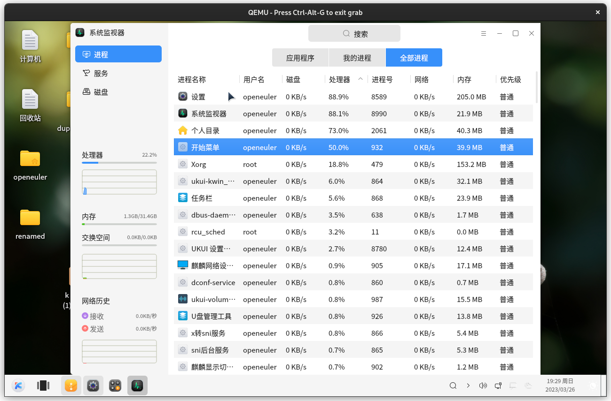

# system monitor 操作

## 操作步骤
1. 随机打开应用程序
2. 打开 system monitor

3. 对之前创建的程序进行 stop process/Continue process/End process/Kill process 等操作。
## 预期结果
正常 stop process/Continue process/End process/Kill process

## 其他说明

无。
