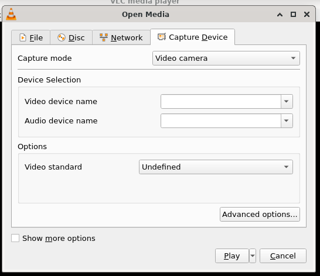

# 从采集卡播放媒体

## 摘要

从采集卡播放媒体。

## 操作步骤

要从采集卡播放，请单击媒体菜单 ‣ 打开捕获设备菜单，如下面的屏幕截图所示。

单击 Open Capture Device 后，屏幕上将显示一个对话框，其中包含可供选择的不同选项和功能。在那里，您可以从下拉菜单中选择首选的捕获模式。

除了上述 VLC 捕获设备的功能外，请参阅下面的更多功能；

- 您可以更改视频设备名称和音频设备名称。
- 用户还可以通过单击配置来调整这些设备的配置。
- 用户可以通过单击高级选项来设置将由 Direct Show 插件播放的视频的大小以及设备属性和调谐器属性等选项。

## 预期结果

正常从采集卡播放媒体。

## 其他说明

本文中，**预期结果**中不含有图片，但不影响测试者理解预期结果。

本测试用例面向 openEuler 操作系统，在此处供测试者参考。
