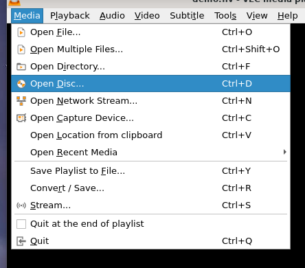
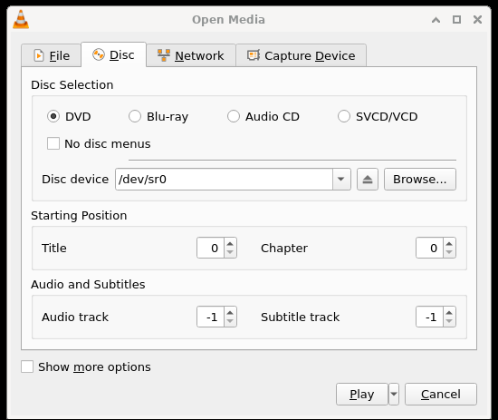
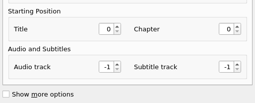

# 光盘设备

## 摘要

播放 CD、VCD 或 DVD。

## 操作步骤

要播放 CD、VCD 或 DVD，请打开 Media ‣ Open Disc 菜单项。

在如下图所示的 “打开磁盘” 对话框中，选择您喜欢的媒体类型（DVD、蓝光、音频 CD 或 SVCD/VCD）。

您可以通过从 “光盘设备” 下拉列表中选择驱动器号来选择媒体所在的驱动器，也可以单击 “浏览” 按钮，这将打开一个对话框，您可以使用该对话框来浏览您的媒体。
 
读取 DVD 时，还有一个无 DVD 菜单选项。

如果您想从给定的标题和章节而不是从头开始播放 DVD 或 VCD，您可以使用标题和章节选择器进行设置。

您还可以使用选择器设置音频和字幕轨道。

## 预期结果

正常播放选中的媒体内容。

## 其他说明

本文中，**预期结果**中不含有图片，但不影响测试者理解预期结果。

本测试用例面向 openEuler 操作系统，在此处供测试者参考。
