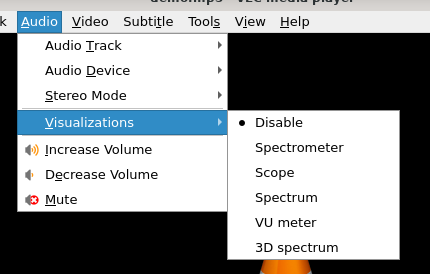

# 可视化音频

## 摘要

可视化显示颜色和几何形状的飞溅，并根据一段音乐生成动画图像。从 “音频” 菜单中选择可视化类型选项以查看效果。

## 操作步骤

要禁用可视化，请单击 Visualizations ‣ Disable 下拉菜单。

如图：

## 预期结果

可视化显示音频。

## 其他说明

本文中，**预期结果**中不含有图片，但不影响测试者理解预期结果。

本测试用例面向 openEuler 操作系统，在此处供测试者参考。
