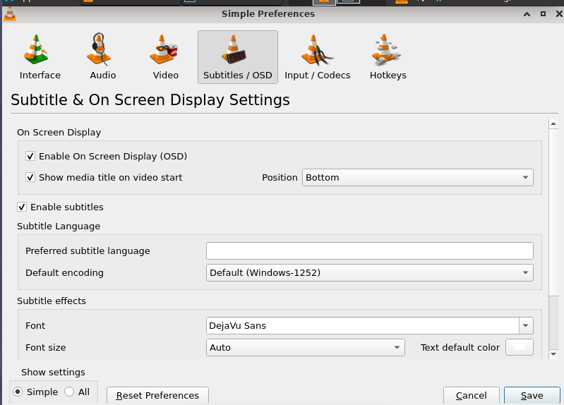
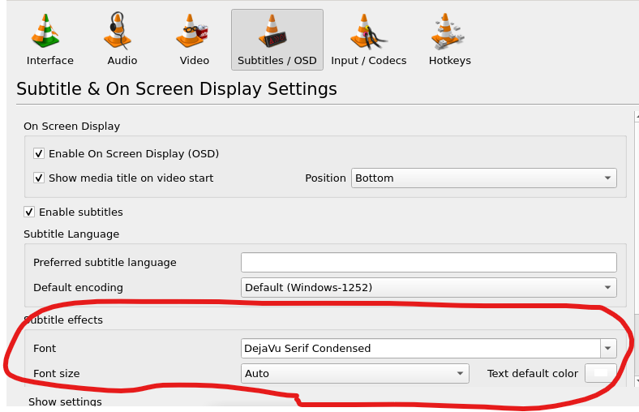
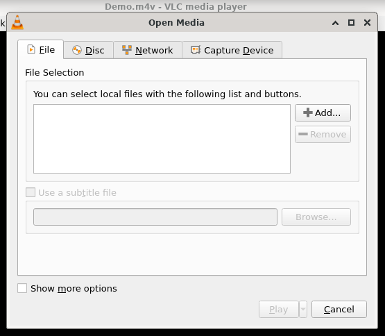

# 字幕

## 摘要

字幕是电影对话的文本版本。

如果您正在观看包含外语的电影，字幕会很有帮助。

## 操作步骤

VLC 媒体播放器默认启用字幕。要禁用它们，请单击字幕菜单以查找文件的可用字幕轨道，然后选择禁用以关闭字幕。

根据媒体的不同，轨道可能会提供描述（例如语言）。

要默认禁用字幕，请转到 Tools ‣ Preferences ‣ Subtitles/OSD，然后取消选中 Enable subtitles 复选框并单击 Save。

### 字体修改

可以在 Tools ‣ Preferences 选项卡中更改文本渲染选项。要更改字体类型和大小，请单击 Videos ‣ Subtitles/OSD，然后从 Font and Font size 下拉菜单中选择您的偏好。

### 字幕文件

要打开和使用字幕文件，请在单击打开多个文件时出现的对话框中单击下图所示的使用字幕文件复选框……

然后单击浏览按钮选择文件。还有一个选项可以设置字符编码、对齐方式和大小。

## 预期结果

正常使用字幕功能。

## 其他说明

本文中，**预期结果**中不含有图片，但不影响测试者理解预期结果。

本测试用例面向 openEuler 操作系统，在此处供测试者参考。
