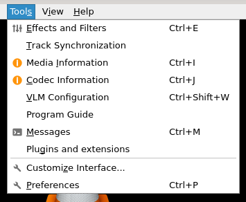

# 工具菜单

## 摘要

此菜单包含了可以使用的工具选项。

## 操作步骤

在此菜单中，您可以：

- 更改音频和视频效果和过滤器。
- 更改音频和字幕同步。
- 查看当前媒体信息。
- 管理插件和扩展。
- 自定义程序设置和界面。
- 修改您的偏好。

## 预期结果

正常使用 **操作步骤** 中提到的选项。

## 其他说明

本文中，**预期结果**中不含有图片，但不影响测试者理解预期结果。

本测试用例面向 openEuler 操作系统，在此处供测试者参考。
