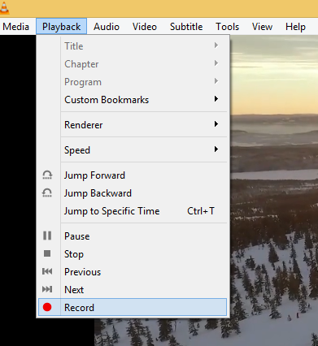
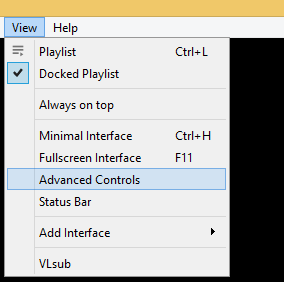

# 录制您正在播放的内容

## 摘要

使用录制按钮录制您正在使用 VLC 播放的任何内容的音频或视频。

## 操作步骤

- 在播放菜单中，单击 “录制” 记录按钮开始录制。

- 再次单击 “录制” 记录按钮以停止录制。

- 您也可以通过单击 “停止” 按钮来停止录制。

### 高级控制

单击 View ‣ Advanced Controls 以在 Playback Controls 正上方显示高级工具栏。此高级工具栏包含 “录制” 按钮。录制按钮可见后，单击它开始录制。

### 自定义界面

选择 Tools ‣ Customize interface menu 并将录制按钮拖动到第 2 行中您选择的任何位置。录制按钮可见后，单击它开始录制。第 2 行是 VLC 上显示的默认行。

## 预期结果

录制正在播放的内容。

## 其他说明

本文中，**预期结果**中不含有图片，但不影响测试者理解预期结果。

本测试用例面向 openEuler 操作系统，在此处供测试者参考。
