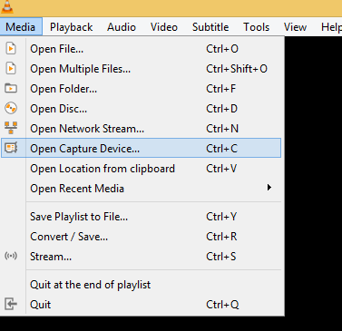
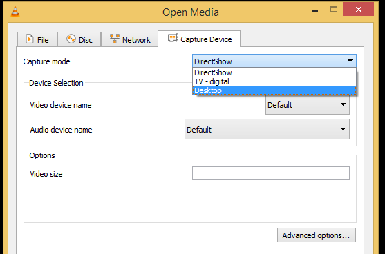
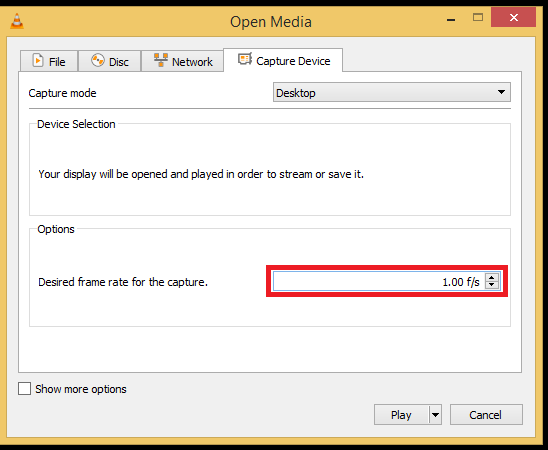
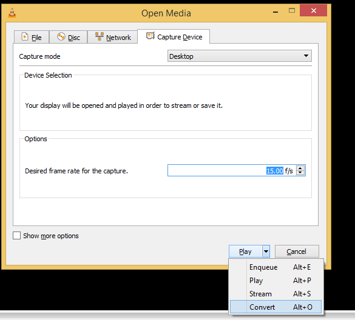
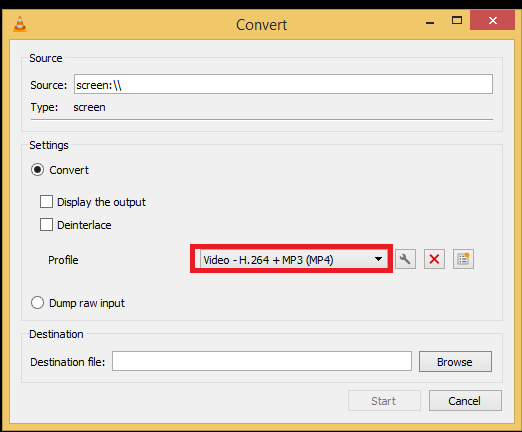
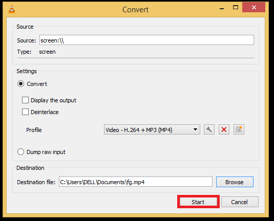

# 录制视频内容

## 摘要

对正在观看的电影/视频进行视频录制，录制桌面，甚至使用网络摄像头或类似的输入设备录制自己。

## 操作步骤

选择 Media ‣ Open capture Device，然后在捕获模式下单击下拉菜单并选择 Desktop。

在选项下设置您想要的帧速率。

单击播放按钮上的箭头，然后选择转换。

在配置文件下单击下拉列表以选择所需的输出格式。

单击浏览以选择保存位置。

单击开始开始录制。

单击停止按钮停止停止录制。您的视频将存储在您选择的目的地。

## 预期结果

正常录制视频内容。

## 其他说明

本文中，**预期结果**中不含有图片，但不影响测试者理解预期结果。

本测试用例面向 openEuler 操作系统，在此处供测试者参考。
