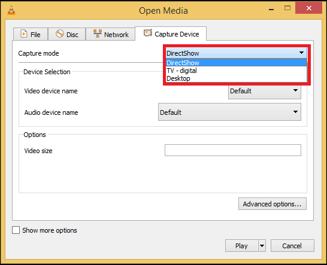
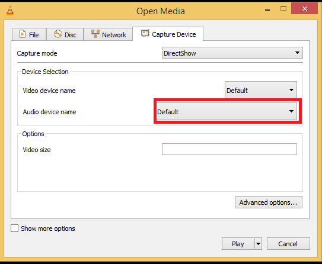
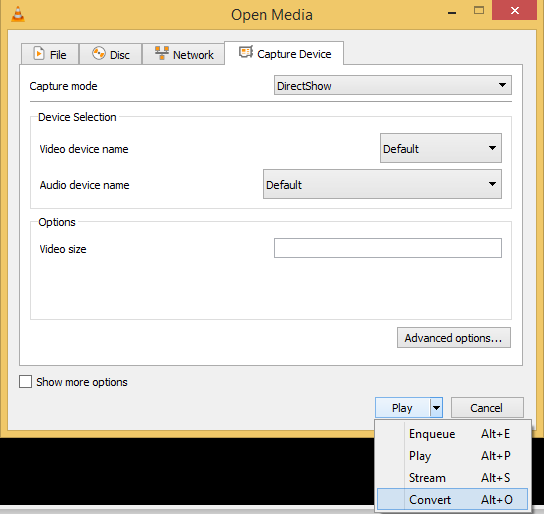
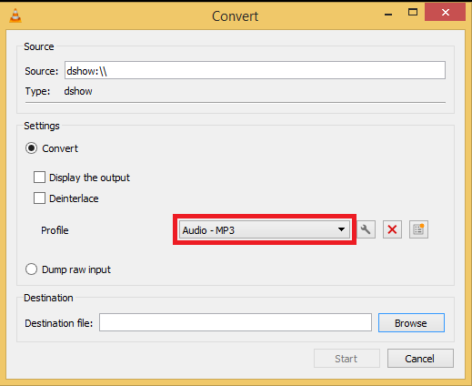
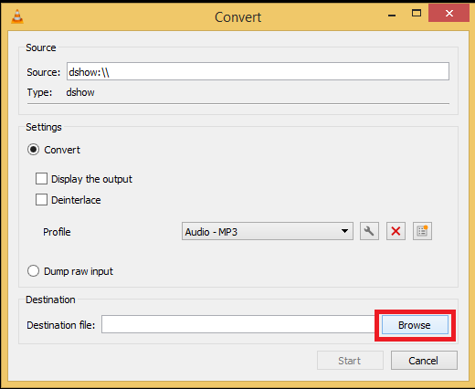
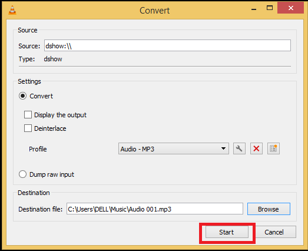

# 录制音频内容

## 摘要

使用录制按钮录制它可以播放的任何音频内容。

## 操作步骤

选择 Media ‣ Open capture Device 或按 Ctrl+C。

然后在捕获模式下单击下拉菜单并选择 DirectShow。

如果要更改录音设备，请单击音频设备名称下的下拉菜单，然后选择所需的设备。

单击播放按钮上的箭头，然后选择转换或按 Alt+O。

在配置文件下单击下拉菜单以选择所需的音频输出格式。

单击浏览以选择保存位置。

单击开始开始录制。

单击停止按钮停止停止录制。您的音频将存储在您选择的目的地。

## 预期结果

正常录制音频内容。

## 其他说明

本文中，**预期结果**中不含有图片，但不影响测试者理解预期结果。

本测试用例面向 openEuler 操作系统，在此处供测试者参考。
