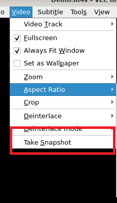

# 快照

## 摘要

将视频的一部分捕获为图像。

## 操作步骤

要从视频中捕获图像，请单击 Video ‣ Take Snapshot。

图像以 .png 图片格式捕获，默认保存在文件夹中。

## 预期结果

正常保存快照。

## 其他说明

本文中，**预期结果**中不含有图片，但不影响测试者理解预期结果。

本测试用例面向 openEuler 操作系统，在此处供测试者参考。
