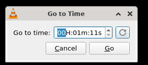

# 指定时间

## 摘要

用于转到媒体文件中的特定帧并再次收听或查看。

## 操作步骤

1. 要指定时间，请选择 Playback ‣ Jump to Specific Time 菜单。将显示转到时间对话框。

2. 在 hh:mm:ss 中输入时间。

3. 单击 “开始” 按钮。控件将跟踪器移动到特定帧，媒体文件从该指定帧继续。

4. 单击取消退出对话框。

## 预期结果

转到媒体文件中的特定帧并再次收听或查看。

## 其他说明

本文中，**预期结果**中不含有图片，但不影响测试者理解预期结果。

本测试用例面向 openEuler 操作系统，在此处供测试者参考。
