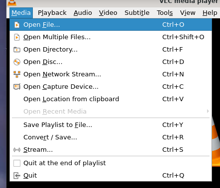
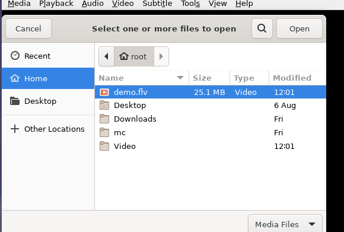

# 播放文件

## 摘要

播放所需媒体文件。

## 操作步骤

要播放文件，请打开媒体菜单，如下图所示：

然后选择打开文件菜单项。

将出现一个打开文件对话框。选择要打开的文件，然后选择 Open。

单击打开后，VLC 将开始播放指定的文件。

上述步骤的替代方法是简单地将文件拖放到 VLC 主界面。

## 预期结果

正常播放选择的媒体文件。

## 其他说明

本文中，**预期结果**中不含有图片，但不影响测试者理解预期结果。

本测试用例面向 openEuler 操作系统，在此处供测试者参考。
