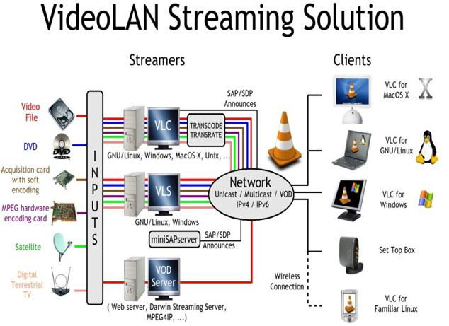
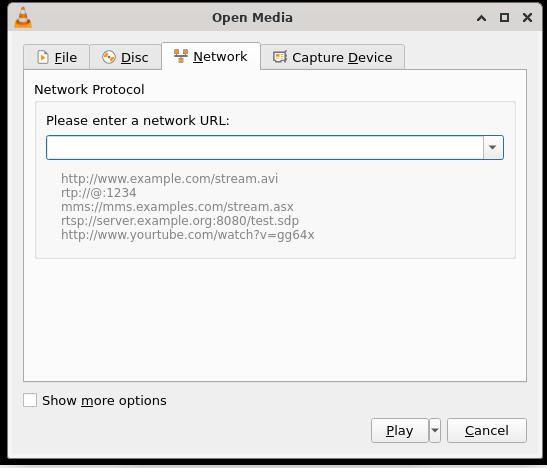

# 播放网络流

## 摘要

以单播或多播的形式在网络上流式传输视频。

## 操作步骤

流媒体是一种通过网络传送音频或视频内容的方法，无需在播放之前下载媒体文件。您可以在内容到达时查看或收听内容。它的优点是您无需在播放大型媒体文件之前等待它们完成下载。

要播放网络流，请单击菜单栏上的媒体并选择打开网络流。打开媒体对话框加载时选择了网络选项卡。在选项卡中，在文本框中输入网络 URL，然后单击 Play。

当 VLC 播放流时，轨道滑块显示流文件的进度。

## 预期结果

正常在高带宽网络上流式传输 MPEG 视频。

以单播或多播的形式在网络上流式传输 MPEG-1、MPEG-2 和 MPEG-4 文件、DVD 和实时视频。

## 其他说明

本文中，**预期结果**中不含有图片，但不影响测试者理解预期结果。

本测试用例面向 openEuler 操作系统，在此处供测试者参考。
