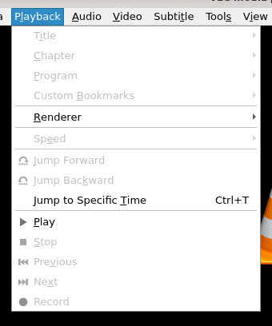

# 播放菜单

## 摘要

控制视频播放。

## 操作步骤

在此菜单中，您可以：

- 选择您要播放的标题、章节或节目。

- 停止播放。

- 移至下一章或上一章。

- 控制您正在播放的媒体的速度。

- 跳转到媒体中的特定章节或时间。

- 创建自定义书签。

## 预期结果

正常完成对视频或音频播放的控制。

## 其他说明

本文中，**预期结果**中不含有图片，但不影响测试者理解预期结果。

本测试用例面向 openEuler 操作系统，在此处供测试者参考。

