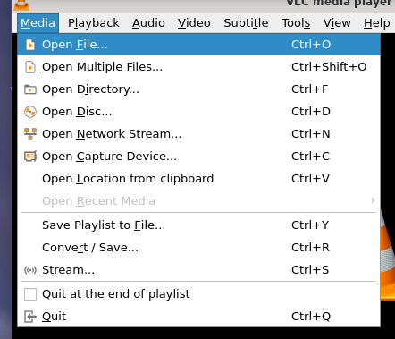
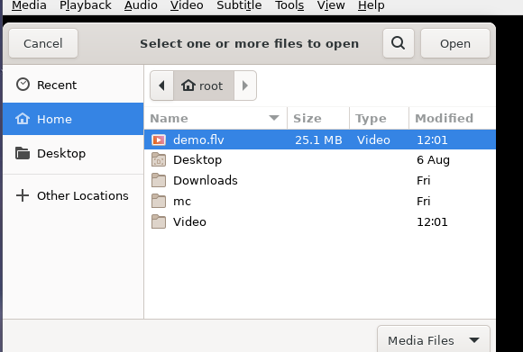

# 播放视频轨道

## 摘要

打开和播放视频轨道。

## 操作步骤

打开和播放视频轨道有两种主要方式：

选择媒体 ‣ 打开文件。

选择一个视频轨道并双击它或单击打开按钮来播放文件。

## 预期结果

打开和播放视频轨道。

## 其他说明

本文中，**预期结果**中不含有图片，但不影响测试者理解预期结果。

本测试用例面向 openEuler 操作系统，在此处供测试者参考。
