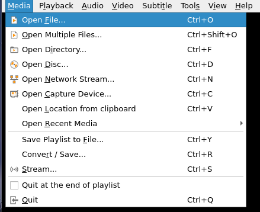
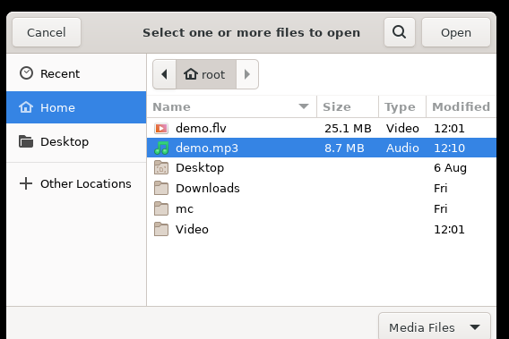

# 播放音轨

## 摘要

播放曲目。

## 操作步骤

要播放曲目，请按照以下步骤操作：

1. 选择媒体 ‣ 打开文件菜单。

2. 选择一个音频文件，然后单击 “打开” 按钮。紧接着，所选曲目将在我的 VLC 上播放。

## 预期结果

正常播放选中的曲目。

## 其他说明

本文中，**预期结果**中不含有图片，但不影响测试者理解预期结果。

本测试用例面向 openEuler 操作系统，在此处供测试者参考。
