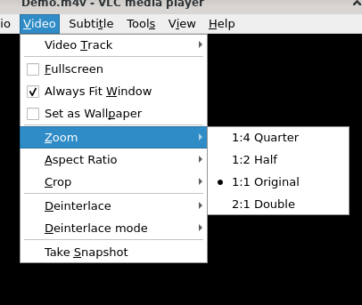
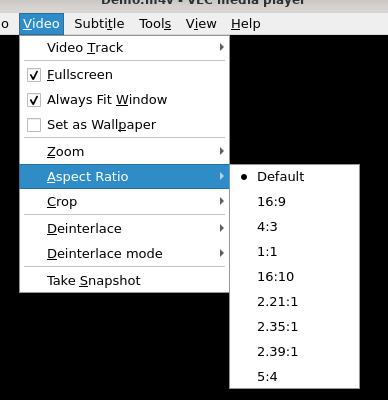

# 放大

## 摘要

放大不同尺寸的视频。

## 操作步骤

要查看特定维度的视频，请在 Video ‣ Zoom 中选择一个维度。

### 纵横比

要选择纵横比，请从 Video ‣ Aspect Ratio 菜单中选择一个值。然后根据所选比例调整视频。

## 预期结果

正常放大视频尺寸。

## 其他说明

本文中，**预期结果**中不含有图片，但不影响测试者理解预期结果。

本测试用例面向 openEuler 操作系统，在此处供测试者参考。
