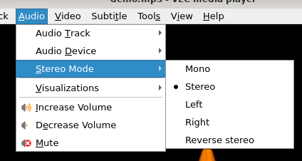

# 立体声模式

## 摘要

以立体声和单声道两种模式收听音频文件。

## 操作步骤

1. 从屏幕上显示的对话框中单击 Media ‣ Open File 或 Open Disc 。

2. 选择一个音频文件，然后单击播放按钮。

3. 如果您想在 Mono 模式下收听音轨，请选择 Audio ‣ Audio Device ‣ Mono 。

4. 如果您想在立体声模式下收听音轨，请选择 Audio ‣ Audio Device ‣ Stereo 。

## 预期结果

以立体声或单声道模式收听音轨。

## 其他说明

本文中，**预期结果**中不含有图片，但不影响测试者理解预期结果。

本测试用例面向 openEuler 操作系统，在此处供测试者参考。
