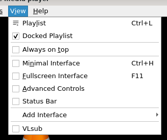

# 视图菜单

## 摘要

此菜单包含了对 VLC 视图的控制选项。

## 操作步骤

在此菜单中，您可以：

- 查看当前和停靠的播放列表。

- 更改播放列表视图模式。

- 更改 VLC 正在使用的接口。

- 添加接口。

- 为 VLC 添加 VLsub 插件。

## 预期结果

正常使用 **操作步骤** 中提到的选项。

## 其他说明

本文中，**预期结果**中不含有图片，但不影响测试者理解预期结果。

本测试用例面向 openEuler 操作系统，在此处供测试者参考。
