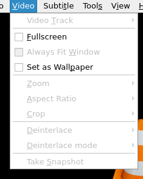

# 视频菜单

## 摘要

此菜单包含可对视频执行的操作。

## 操作步骤

在此菜单中，您可以：

- 选择您想要的视频轨道。

- 将视频设置为全屏播放。

- 设置为墙纸。

- 更改缩放、纵横比和裁剪。

- 调整去隔行和后期处理选项（高级用户）。

- 对当前帧进行截图。

## 预期结果

正常执行 **操作步骤** 中所提到的功能。

## 其他说明

本文中，**预期结果**中不含有图片，但不影响测试者理解预期结果。

本测试用例面向 openEuler 操作系统，在此处供测试者参考。
