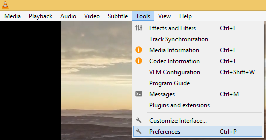
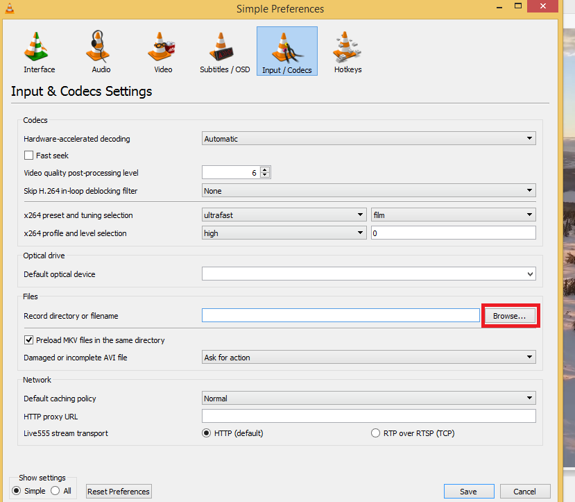
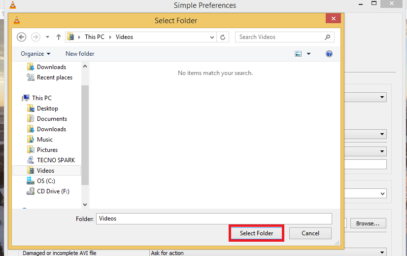
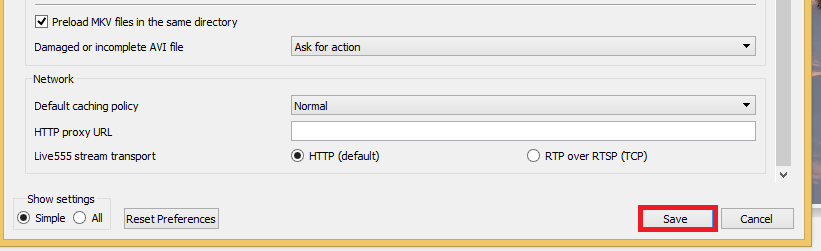

# 选择您的录音文件夹

## 摘要

修改用于存储录音的文件夹。

## 操作步骤

选择 工具 ‣ 首选项 或按 Ctrl+P。

单击 Input/Codecs，在 Files 下单击 Browse... 为您的录音选择一个位置。

点击保存。

## 预期结果

修改用于存储录音的文件夹。

## 其他说明

本文中，**预期结果**中不含有图片，但不影响测试者理解预期结果。

本测试用例面向 openEuler 操作系统，在此处供测试者参考。
