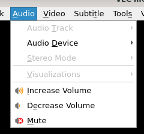

# 音频菜单

## 摘要

执行对音频的控制操作。

## 操作步骤

在此菜单中，您可以：

- 选择您想要的音轨
- 更改媒体的立体声模式。
- 更改设备以播放音频。
- 启用内置的可视化。
- 增加和减少音量。
- 静音播放。

## 预期结果

正常控制播放的音频。

## 其他说明

本文中，**预期结果**中不含有图片，但不影响测试者理解预期结果。

本测试用例面向 openEuler 操作系统，在此处供测试者参考。
