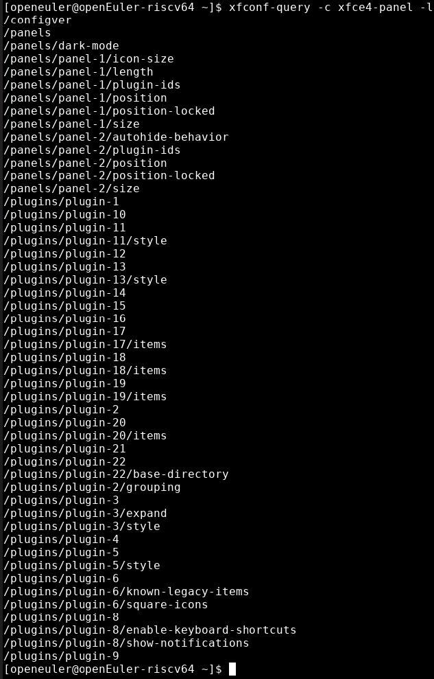
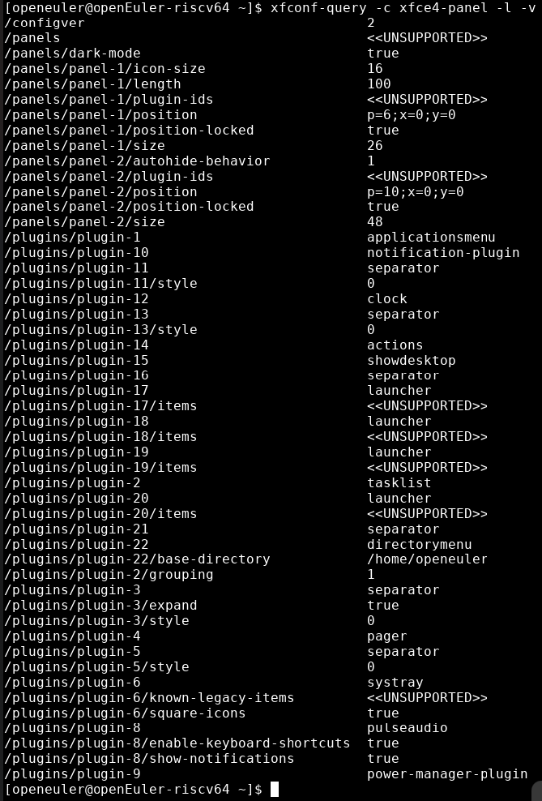

# 列出配置项属性与值

## 摘要

- 使用xfconf-query进行命令行式的查看与修改xfconf的配置项

## 操作步骤

1. 输入命令```xfconf-query -c xfce4-panel -l```，查看输出结果
2. 输入命令```xfconf-query -c xfce4-panel -l -v```，查看输出结果

## 预期结果

1. 输出类似下图，输出xfce4-panel配置项的所有属性



2. 输出类似下图，输出xfce4-panel配置项的所有属性与值



## 其他说明

无。
