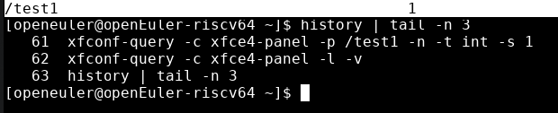

# 创建键值对

## 摘要

- 使用xfconf-query进行命令行式的查看与修改xfconf的配置项

## 操作步骤

1. 输入命令```xfconf-query -c xfce4-panel -p /test1 -n -t int -s 1```，查看输出结果
2. 输入命令```xfconf-query -c xfce4-panel -l -v```，查看输出结果

## 预期结果

- 出现了test1 值为1


## 其他说明

无。
