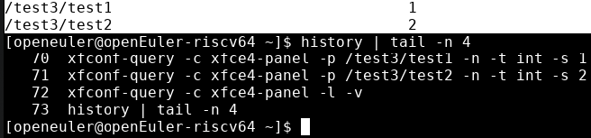
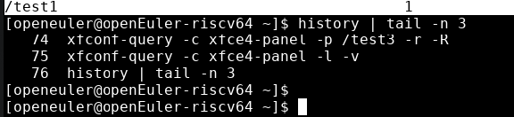

# 创建键值对

## 摘要

- 使用xfconf-query进行命令行式的查看与修改xfconf的配置项

## 操作步骤

1. 输入命令```xfconf-query -c xfce4-panel -p /test3/test1 -t int -s 1```，查看输出结果
2. 输入命令```xfconf-query -c xfce4-panel -p /test3/test2 -t int -s 2```，查看输出结果
3. 输入命令```xfconf-query -c xfce4-panel -l -v```，查看输出结果
4. 输入命令```xfconf-query -c xfce4-panel -p /test3 -r -R```，查看输出结果
5. 输入命令```xfconf-query -c xfce4-panel -l -v```，查看输出结果

## 预期结果

1. 出现了/test3/test1 /test3/test2


2. 两者消失不见


## 其他说明

无。
