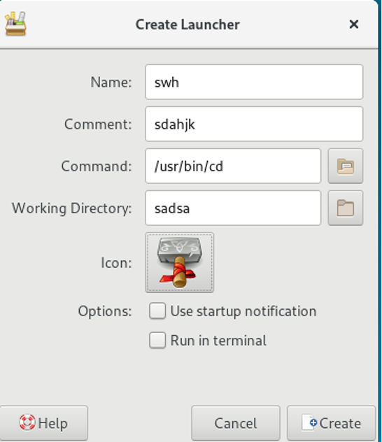
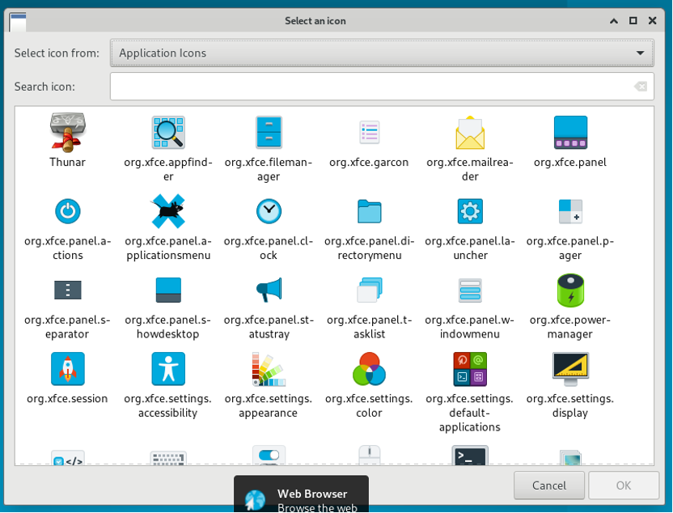
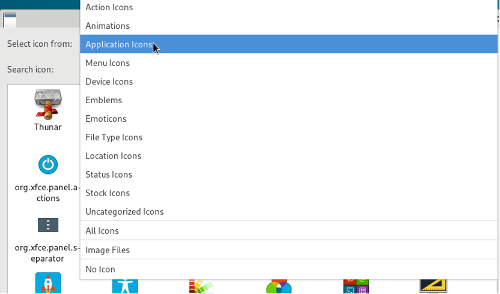
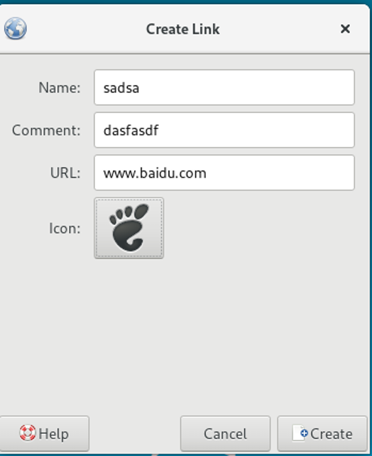

# Icon 测试

## 摘要

关于 Create Launcher 内的 Icon 进行的测试以及说明。

## 操作步骤

### 点击 Icon 按钮。

Icon 按钮正常启动。

### select icon from 下拉框正常，可以正常点击。

### 使用 Search icon 进行搜索。

查找功能正常。

### 选择搜索到的 Icon 。

选择功能正常。

## 预期结果

各个功能正常运行。

## 其他说明

无。
