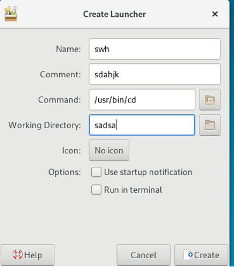
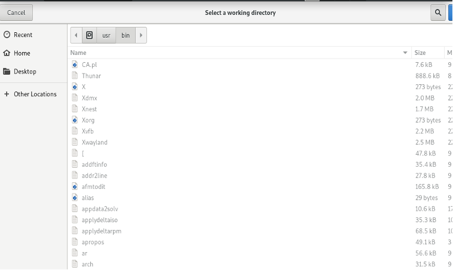

# Working Directory 文本框

## 摘要

关于 Create Launcher 的 Working Directory 文本框测试。

## 操作步骤

向 Working Directory 文本框内输入内容。

## 预期结果

Working Directory 文本框显示正常，可以正常输入文本信息，也可以通过文本框后面的文件仓库查找。文件仓库正常启动以及正常显示以及确认。

## 其他说明

无。
