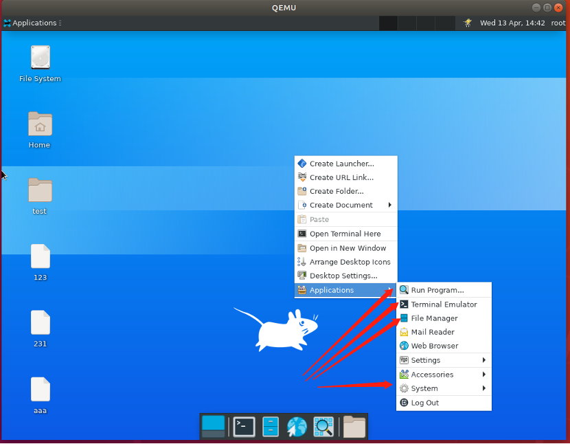
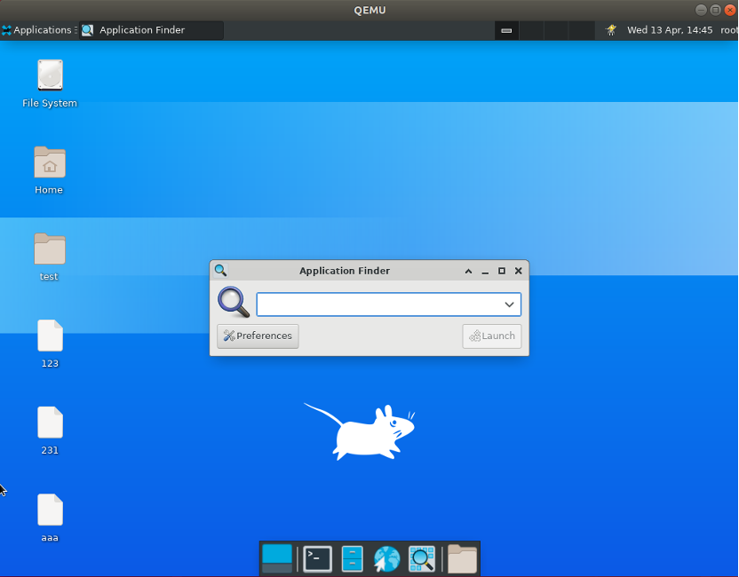
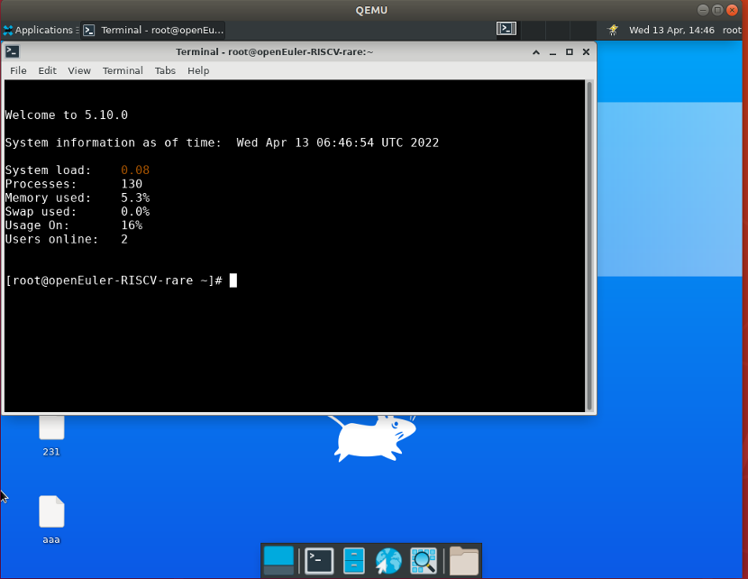
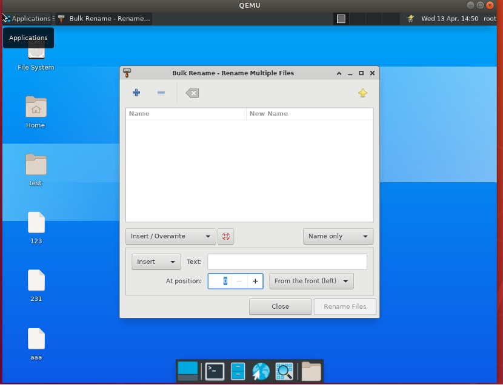
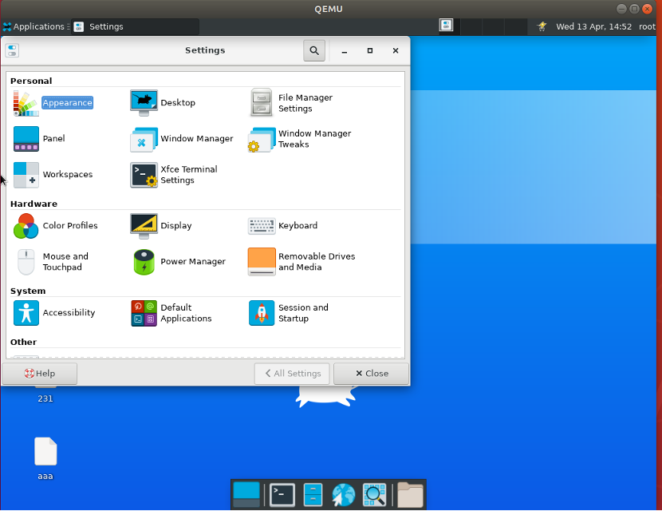
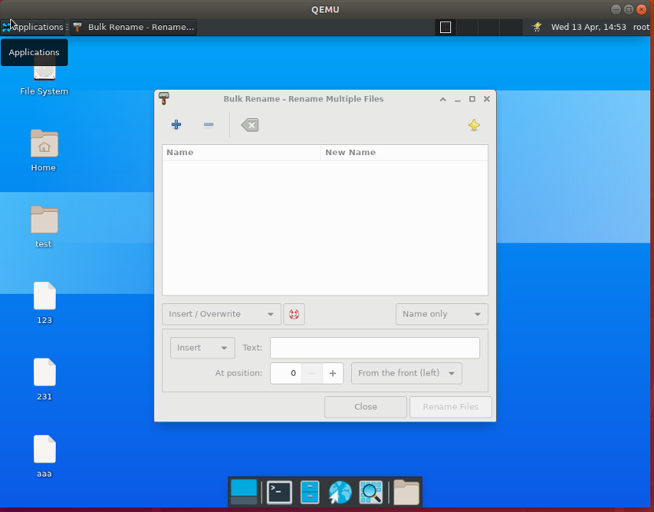
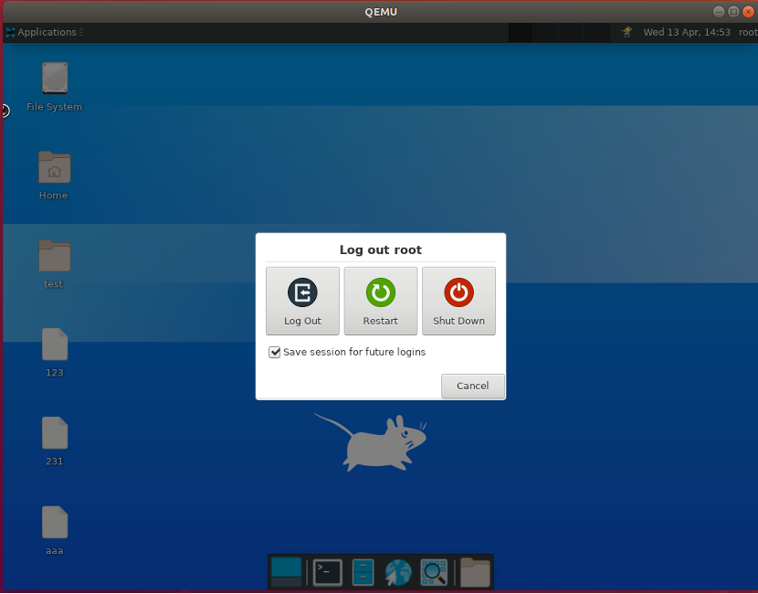

# 测试 Applications

## 摘要

测试 Xfce 中的 Applications 功能。

## 操作步骤

右键桌面，点击 Applications 。

Application -> run Program 。

Application -> Terminal Emulator

Application -> File Manager

Application -> System -> Bulk Rename

其他功能 Settings ， Accessories ， Log Out 均正常显示，结果如下图所示：

## 预期效果

如图所示，所有功能正常。

## 其他说明

Desktop Manager 功能正常，异常情况只有 Application -> Terminal Emulator 极少情况（只出现过一次）会无反应。
