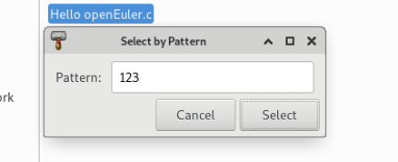
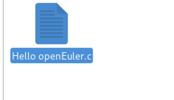

# Select All 与 Select By Pattern 测试

## 摘要

对于 Select All 与 Select By Pattern 的功能进行测试以及说明。

## 操作步骤

在状态栏上选择 Edit -> Select All 。

在状态栏上选择 Edit -> Select By Pattern 。

## 预期结果

所有功能正常运行。

## 其他说明

无。
