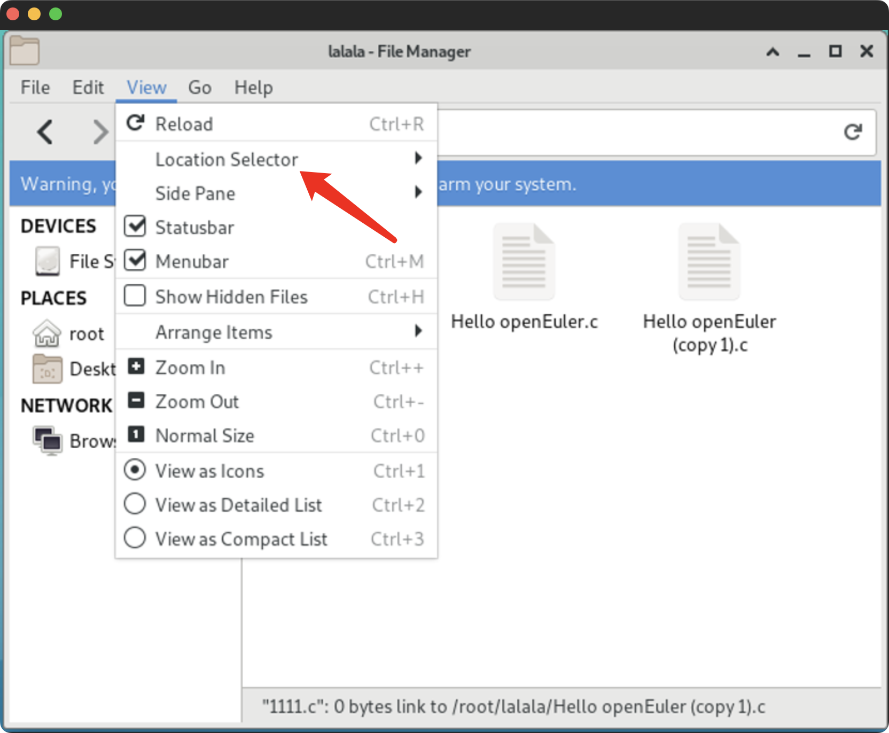
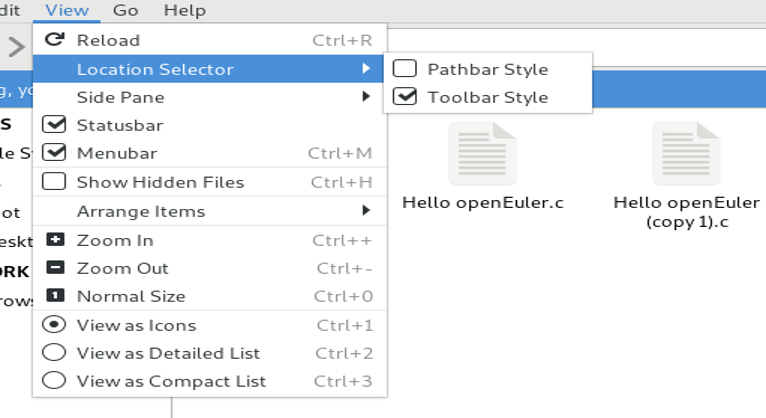
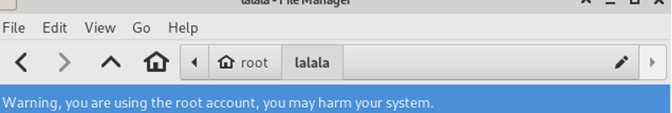
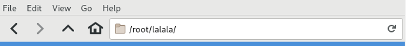

# 设置 Bar 样式

## 摘要

关于在 File Manager 下 Location Selector 的功能测试说明。

## 操作步骤

状态栏中选择 View -> Location Selector  。

您将会看到分别有 Pathbar Style 和 Toolbar Style 两种选项。

### 设置 Bar 样式：

下图为 Pathbar Style 。

下图为 Toolbar Style 。

## 预期结果

两种 Bar 样式正常设定。

## 其他说明

无。
