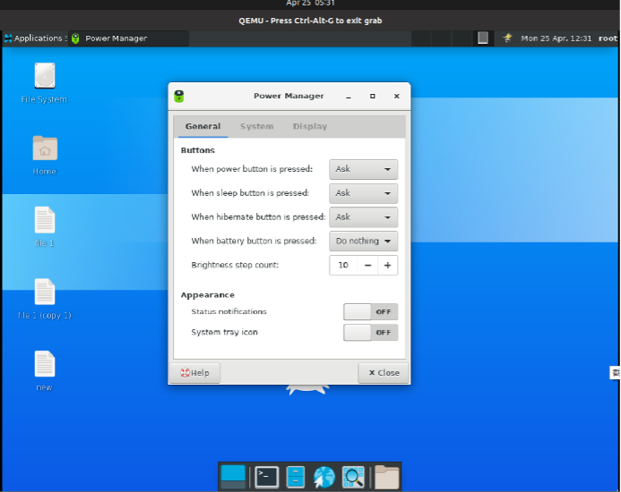
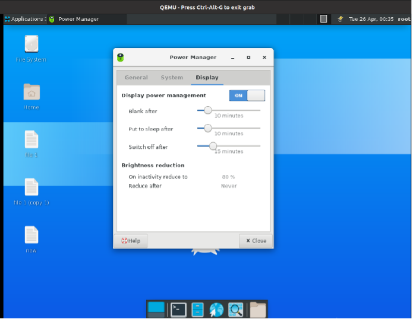
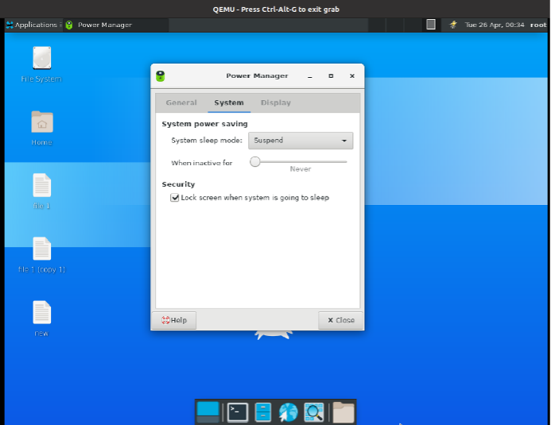

# Power Manager 功能

## 摘要

关于 Power Manager 功能的说明。

## 操作步骤

在 terminal emulator 中输入以下代码打开 Power Manager 。

```
xfce4-power-manager -c 
```







如上图所示，Power Manager分为 General 、 System 、 Display 三个模块。

## 预期结果

Power Manager 正常启动。

## 其他说明

无。
