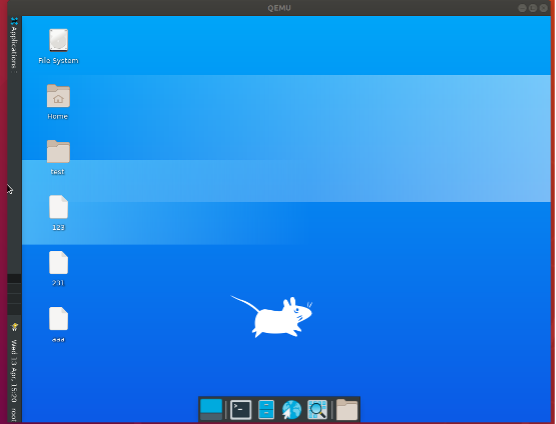
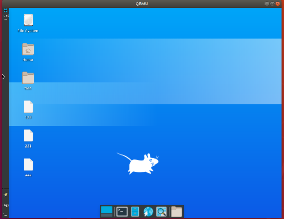

# 测试 Vertical 和 Deskbar

## 摘要

测试 General -> Mode 中的 Vertical 和 Deskbar 的功能。

## 操作步骤

在 General -> Mode 中设置为： Vertical 和 Deskbar 。

## 预期结果

下图为 Vertical ：

下图为 Deskbar ：

如上图所示，功能正常。

## 其他说明

无。
