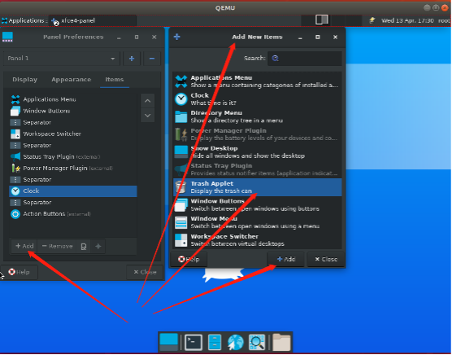
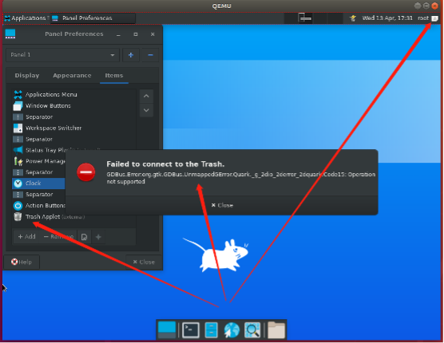

# 添加图标 Trash Applet

## 摘要

测试添加图标 Trash Applet 功能。

## 操作步骤

打开 Panel Preferences -> item -> Trash Applet 。

## 预期结果

Trash Applet 图标正常添加。

## 实际结果

如上图所示，存在 bug ，添加以后，右上角的图标不能正常显示，点击以后显示失败连接。

## 其他说明

无。
