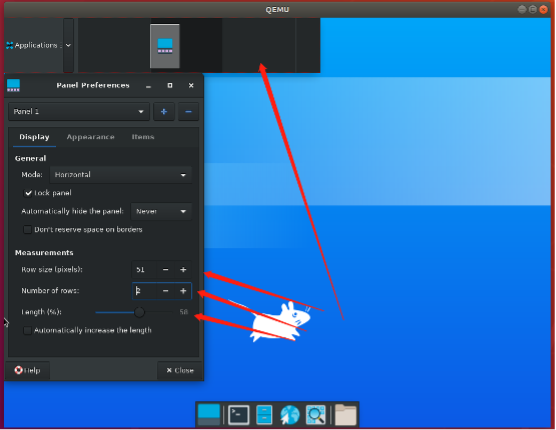

# 调节面板大小

## 摘要

测试调节面板大小功能是否正常。

## 操作步骤

在 Panel Preferences -> Display ->Measurements 中将参数调整为以下大小：

Measurements :

-> Row size: 26 -> 51

-> Number of roes:1 -> 2

-> Length:100 -> 58

## 预期结果

如上图所示，可以正常调节面板大小、行数和长度，功能正常。

## 其他说明

无。
